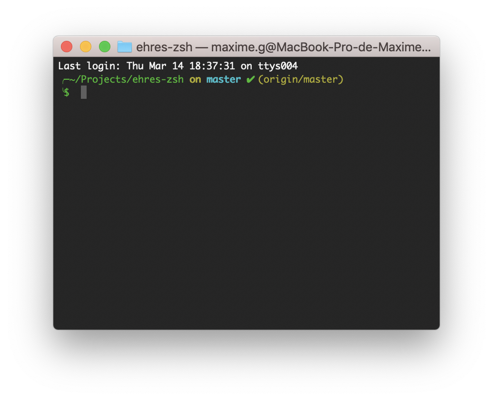

# ehres-zsh-theme

# Install

## Manually

https://github.com/robbyrussell/oh-my-zsh/wiki/Customization#using-another-customization-directory

## With Antibody

```
robbyrussell/oh-my-zsh path:lib
Ehres/ehres-zsh path:themes
```

## With zplug

```
zplug 'Ehres/ehres-zsh', as:theme, use:themes/ehres.zsh-theme
```

## Using another customization directory

If you don't want to use the built-in custom directory itself, just change the path of $ZSH_CUSTOM inside your .zshrc to a directory of your own liking. Everything will be fine as long as you adhere to the conventional file hierarchy.

~/.zshrc

```
ZSH_CUSTOM=$HOME/ehres-zsh
```
File tree inside of your home directory:

```
$HOME
└── ehres-zsh
    └── themes
        └── ehres-zsh.zsh-theme
```

# Preview


